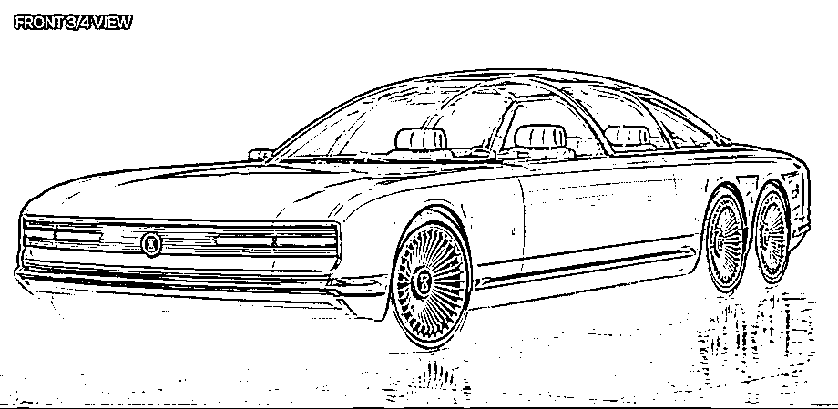
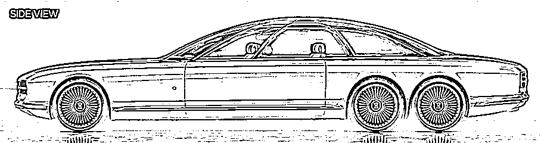
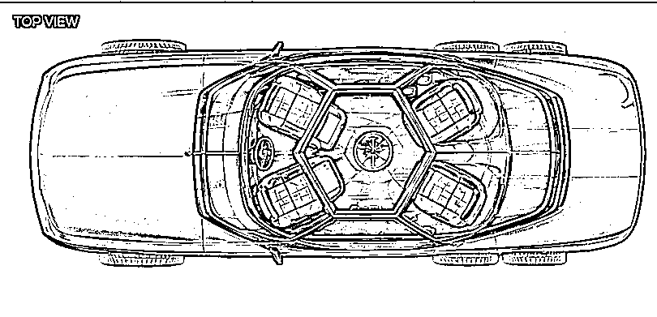
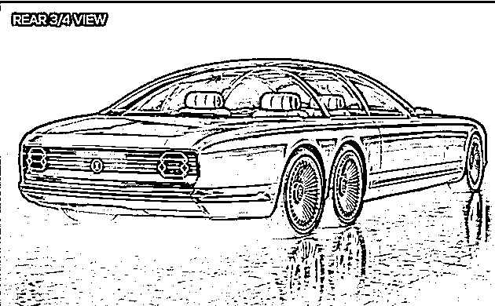
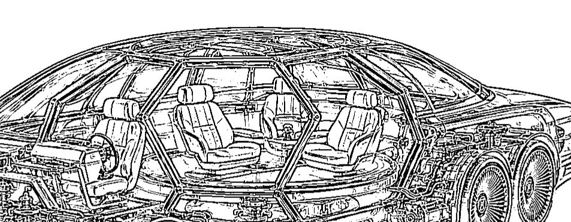

# I1

This vehicle is a retro-futuristic six-wheel luxury sedan with an elongated, low-profile body inspired by classic grand touring cars. It uses three wheels on each side, a reinforced central passenger cell, and a spacious interior for one driver and four passengers. The seating compartment can rotate or reorient, allowing passengers to face one another or turn toward the doors for easier access.

(C) 2026 PEZHMAN FARHANGI 
